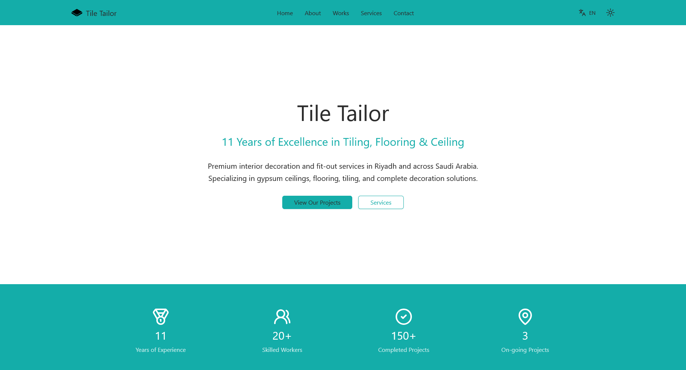

# Tile Tailor

A professional business website developed for a Saudi client specializing in interior decoration, gypsum ceilings, flooring, tiling, and renovation services. The site showcases their portfolio and facilitates client engagement through an elegant, responsive interface.

## 🏗️ Project Overview

This website serves as a digital presence for an interior decoration company based in Saudi Arabia, highlighting their expertise in:
- Interior Decoration & Design
- Gypsum Ceilings & Partitions
- Flooring & Tiling Solutions
- Complete Renovation Services
- Luxury Villa Fit-outs

## ✨ Key Features

- **Project Portfolio Showcase**: Interactive display of completed projects across Riyadh districts
- **Location-Based Project Filtering**: Projects organized by region (Northern, Eastern, Central Riyadh)
- **Responsive Design**: Fully optimized for mobile, tablet, and desktop viewing
- **Multi-language Support**: Arabic/English interface (RTL support)
- **Contact Integration**: Easy client inquiry and consultation booking
- **Project Map Integration**: Location-based project visualization

## 🛠️ Technologies Used

- **Framework**: Next.js (React)
- **Styling**: Tailwind CSS
- **Language**: TypeScript
- **Maps Integration**: Google Maps API
- **Icons**: Lucide React / React Icons
- **Deployment**: Vercel / Netlify

## 📅 Project Completion

- **Completion Date**: March 2, 2026
- **Development Timeline**: 1 Week
- **Status**: Live & Fully Deployed
